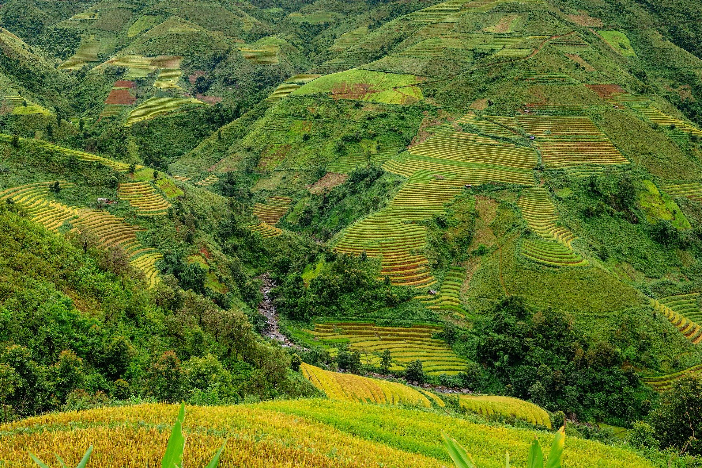

# Drone-Image-Analysis-Project

# Introduction
Repository related to programming for drone missions and subsequent image analysis using Python language. So far image analysis is contained to green object detection which has a wide range of use cases in agriculture, environmental and Earth sciences.

# Prerequisites
- Python 3
- OpenCV Python library

# Examples of use
Before:

After running python script:

# Acknowledgements
